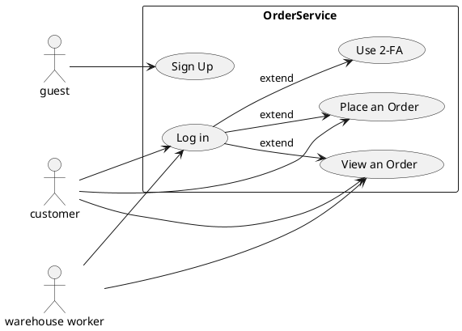
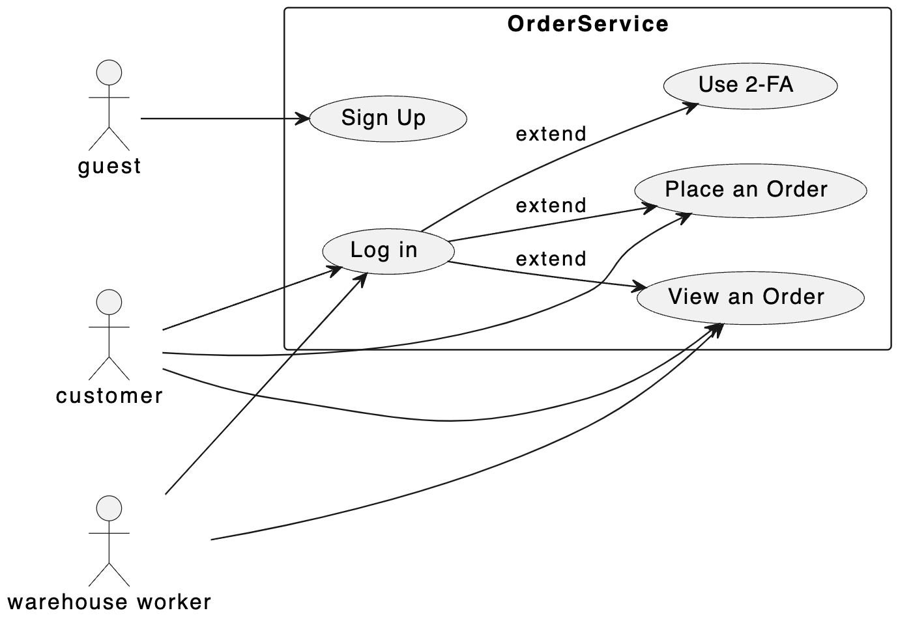
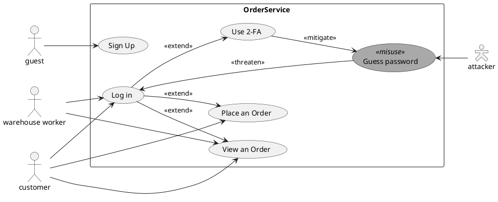
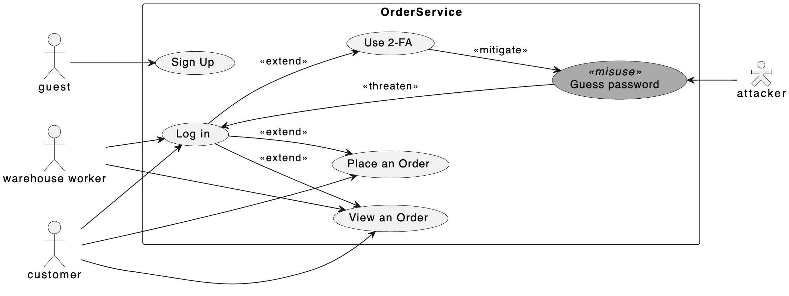
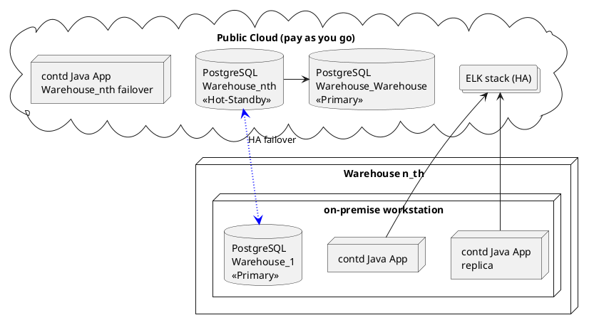
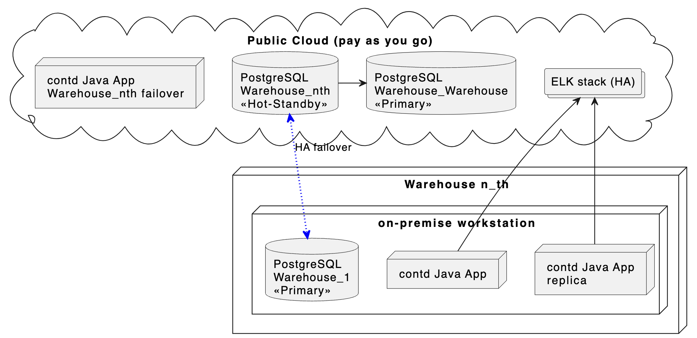
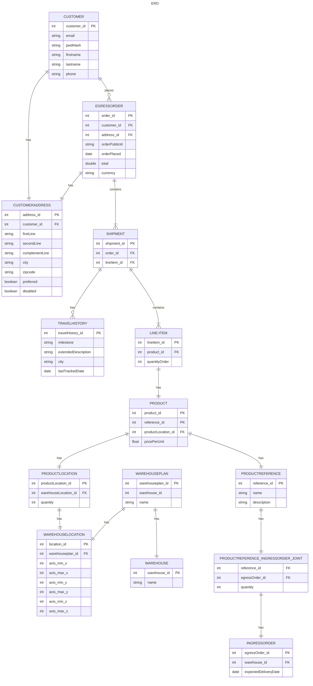

# Problem Statement

You are given a scenario where you are asked to design a simple system for managing orders that a warehouse for your company ABC receives from its customers and queueing them for delivery. You are free to make any assumptions about the business, customers, and orders' schema as you see fit.  

# Proposed System Design

## Assumptions 

- We only focus on the order management for the end user, we assume the company already has process in place to:
  - Dynamically group orders for the warehouse worker in an efficient manner based on production metrics, and according the established service level agreement,
  - Compute shortest paths within the warehouse so as to optimize warehouse workers trip time,
  - Reorganize the items within the warehouse as to optimize efficiency (e.g. trending and seasonal items could be rearranged throughout the year).
- We assume the payment to be processed by a 3rd party (we do not store financial information).

## Use Cases 

## Misuse Case Diagram

# Tech Stack Decision Process

Deriving from my limited understanding of operating a warehouse, it seems to me that each task is relatively simple. However, each task must be executed as fast as possible, and most of the complexity lies in scheduling and optimizing those tasks.  

More importantly, any unplanned downtime results in tremendous (hidden) costs. Worse, any downtime incident is most likely to result in a snowball effect. 
Thus, no unplanned downtime is tolerated and the software architecture and deployment must be designed accordingly. 

As a result, we stir away from any architecture requiring composition at the network level (such as a microservices architecture). This is because all bets are off as soon as calls are made over the network and this is not in line with our availability requirements. Moreover, since warehouse workers' tasks are time-sensitive, [the tail latency incurred by microservice architectures](https://dl.acm.org/doi/pdf/10.1145/3297858.3304013) is likely to result in QoS violations. 

Thus, we **favor a monolithic architecture** where the development of various modules/libraries may still be distributed between software development teams. 

The chosen technology stack is the **Java programming language** with the **SpringBoot framework**, used in conjunction with a **PostgreSQL database**, and an **ELK logging system**. Ideally, we would choose a programming language that offers stronger guarantees than Java (such as OCaml or Haskell). However, despite the recent arrival of Web frameworks in those languages (such as [Dream](https://aantron.github.io/dream/)), the support for production tasks remains to be proven (e.g. large-scale system profiling, metrics aggregation, and so on). Moreover, Java remains to this day one of the best language to model complex systems and tasks within a monolithic architecture. It also has great community support and open-source libraries that are proven to work in a large-scale production-ready system. PostgreSQL is a database technology whose robustness and efficiency no longer need to be proven. It is still found within big-tech production systems. Finally, we prefer an ELK stack over other log management systems such as Graylog2 for its versatility, despite the fact that it is more complicated to use. This is because the ELK stack could be used for system monitoring and security purposes later on; not just application logging (some XDR such as Wazuh integrates with an ELK stack).  

# Threat Model (Scope: Software Security)

**Foreword.** As per the challenge statement *"use docker to create containers for the service you implemented as well as the database"*, we solely focus on software security (infrastructure as code (IaC) included). We do not consider security for the IT infrastructure since we do not have control over it. In a real-world scenario, we should consider system hardening, and more broadly, a defense-in-depth approach: from physical security, policies and procedures, VPNs, Firewalls, DMZs, secure architecture, account management, rule-based access control, patch management, to virus scanners. 

We take a very high-level approach to security and apply the CIA triad concept. We limit ourselves to the biggest threats due to time constraints. 
- We approach **confidentiality (C)** by considering the information life cycle as well as dataflow in our application,
- **Integrity (I)** threats are mostly mitigated by our architectural choices. The monolithic architecture mitigates most alternative and error flows that could occur at the network level. The deployment of the database in a high-availability manner should also mitigate potential data tampering. Ideally, we should also consider using model checking tools such as Alloy. They were not used as part of this exercise due to time constraints. 
- **Availability (A)**:
  - The proposed solution attempts at considering a maximum tolerable downtime (MTD) (or maximum perdio time of disruption (MPTD)) of *Mission Critical*, that is, any incident must be resolved either in a continuous manner or within 1 minute - solely in technology terms. This is mainly achieved by thinking the software architecture and deployment to be highly-available (HA) deployment, see deployment diagram below.  
  - We impose ourselves the constraint of having no physical redundant sites (not in technology terms). This is because we assume that having redundant sites (whether hot site or cold site) for disaster recovery is too expensive within a warehouse scenarii. 

The interview problem (Task T.1) consist in the development of a simple Web service or API. We chose to develop a **Web API**. Therefore, we consider **Web API-specific risks** in our threat model.  
In a (not yet published) study, we analyzed more than 400 real-world cases of Web API security bugs spanning from 2018 to 2022. Our conclusion is that the Web API threat model is different than the one of regular Web applications, specifically: 
- Improper access control (CWE-284) accounts for 41% of all weaknesses, 
- Improper control of a resource through its lifetime (CWE-664), 26%,
- Protection mechanism failure (CWE-693), 12%,
- Improper neutralization (CWE-707), 9%,
- Other (CWE-691, CWE-435, CWE-703, CWE-697), 12%.

To mitigate Web API security risks, we implement preventive security controls in our proposed solution. Other types of security controls (detective, corrective, deterrent, recovery and compensating) are left for future work.  

Weakness | Implemented Mitigation Mechanism 
---|---
CWE-284 | Fail-closed Access Control Matrix (ACM) with unit tests that fail if the ACM is invalid (unspecified role/permission).   
CWE-664 | Annotations in the Web API models for Information Flow Control. Unit tests fail if any annotation is missing, or, if a condition in the ACM is violated.    
CWE-693 | Web API traffic is encrypted via the HTTPS reverse-proxy, cryptographic algorithms follow the latest standards, and there is no alternate path (no API Composition).
CWE-707 | We mitigate injection by filtering input (especially user-controlled input); we also rely on a static code analyzer (SonarQube) to alert us in case of improper neutralization.   
CWE-691 | Annotations in the Web API models for Information Flow Control. Unit tests fail if any annotation is missing, or, if a condition in the ACM is violated.  
CWE-435 | Unfortunately, the use of model checking could not be implemented within the allotted time.  
CWE-703 | We mitigate improper check or handling of exceptional condition by using a static code analyzer (SonarQube) to alert us in case of improper neutralization, our linter, and the fact that the chosen programming language is typed. 
CWE-697 | We mitigate incorrect comparison by using a static code analyzer (SonarQube) to alert us in case of improper neutralization, our linter, and the fact that the chosen programming language is typed. 

<!-- dtrack, sonarqube, travis, newman. -->

## Deployment/Infrastructure Architecture

We propose an hybrid cloud infrastructure where each warehouse has private cloud composed of a single workstation that runs their information system, and the public cloud as a failover for high-availability. This choice results from the following considerations: 
- Having an on-premise workstation directly within the warehouse allows for: 
  - Warehouse operations continue even in the event of a network outage,
  - If a proper power protection policy is implemented at the warehouse, then warehouse operations could continue in the event of a power outage (UPSs, power line conditioners, or backup sources),  
  - Reduced (negligible) delays due to network latency (intranet),
  - (Bonus) reduces the Cloud bill (pay as you go). 
- In case the warehouse on-premise workstation is down: 
  - Any request set to the workstation (with a short timeout), will be sent again to the public cloud, 
  - The public cloud is used as failover, thus ensuring business continuity and helping in case of disaster recovery scenario.  

Note: despite the use of a public cloud, we still recommend to have policy and procedure in place for cold-storage (and/or an air-gapped infrastructure for) backup and backup verification (including ensuring media integrity) to avoid a rude awakening upon discovering that data was permanently lost.   

One might wonder why we also recommend the use of a warehouse database (i.e., the aggregation of each warehouse database into a single database). The warehouse database is thought for data aggregation and data analytics. Hence, correlations can be made by the engineering team, and recommendation can be presented to the decision makers in an attempt to optimize operations.  

## DB Architecture

## Efficiency

Efficiency (or complexity) is a hard topic and is closely linked to the operations of the system. Still, we implemented a naive cache strategy as well as some logging and profiling functionalities to monitor performance.  
In a real-world system, the cache strategy would be optimized based on production data.  
